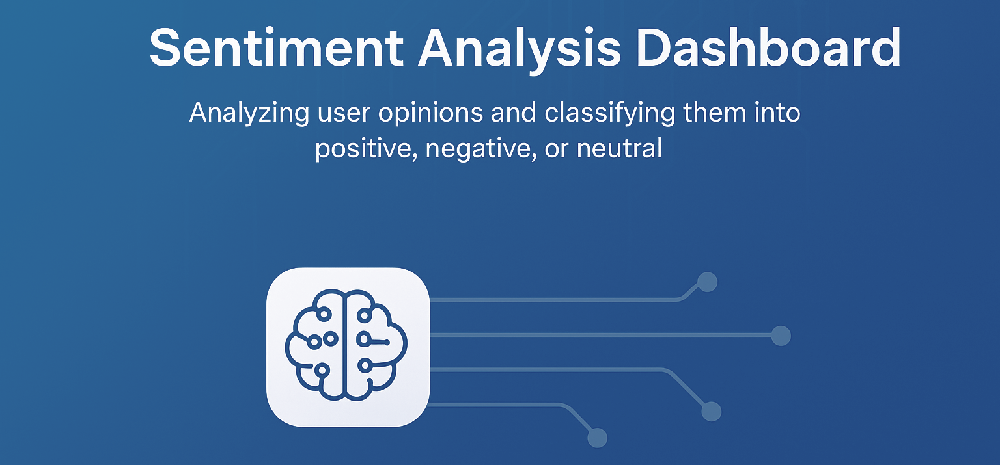

#  Sentiment Analysis App

A web application built with **Streamlit** that performs **sentiment analysis** on user-provided text or uploaded files.  
The app classifies sentiments into three categories: **Positive 😊**, **Neutral 😐**, and **Negative 😡**.

---

##  Features

-  Analyze text or comments in real-time.  
-  Upload CSV files for bulk sentiment analysis.  
-  Interactive charts to visualize sentiment distribution.  
-  Uses a pre-trained machine learning model (`model.joblib`).  
-  Simple and elegant Streamlit dashboard interface.

---

##  Demo Preview

## 🚀 Application  - User Input
[Watch the demo](https://github.com/user-attachments/assets/870e937e-0648-4b77-aea1-1e135c25a42d)

## 🚀 Application  - Sentiment Analysis Dashboard
https://github.com/user-attachments/assets/4794786f-1c88-449c-a1cb-cf3ad0634371

